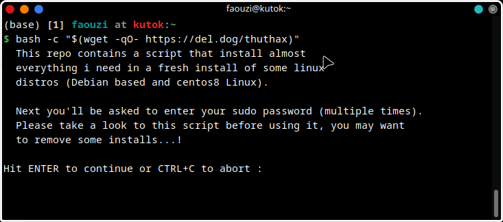

# fast-configure
This repo contains a script that install almost everything i need in a fresh install of some linux distros (Debian based ~and centos8 Linux~)   




## How use the script ?
- The git way
```bash
git clone https://github.com/faouziMohamed/fast-configure.git
cd fast-configure && chmod +x install-everything.sh
./install-everything.sh
```

- Git free  
Just open a terminal then run
```bash
bash -c "$(wget -qO- https://del.dog/thuthax)
```

*`https://del.dog/thuthax` url is a shortned url for `https://raw.githubusercontent.com/faouziMohamed/fast-configure/main/install-everything.sh`*
thanks to the [dogbin/dogbin](https://github.com/dogbin/dogbin) project.

<!--
```bash
bash -c "$(wget -qO- https://faouzimohamed.github.io/rdr/4)"
```
-->
